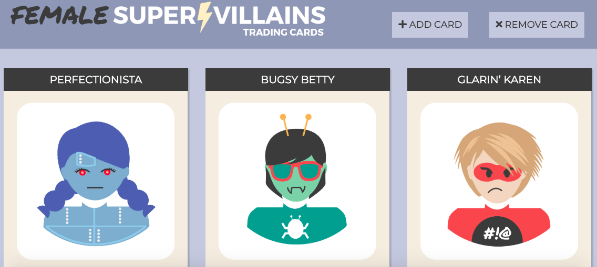

# Female-Supervillain-App-REST-Version
A Python App using Javascript to create an API.

This is the link to the Repl.it files for this app.  The app was created with Python using a REST API to connect.

https://repl.it/@chaudhryna/Hard-Redesigning-for-RESTful-Routes-Endpoints

Here's a screen shot of the app.

